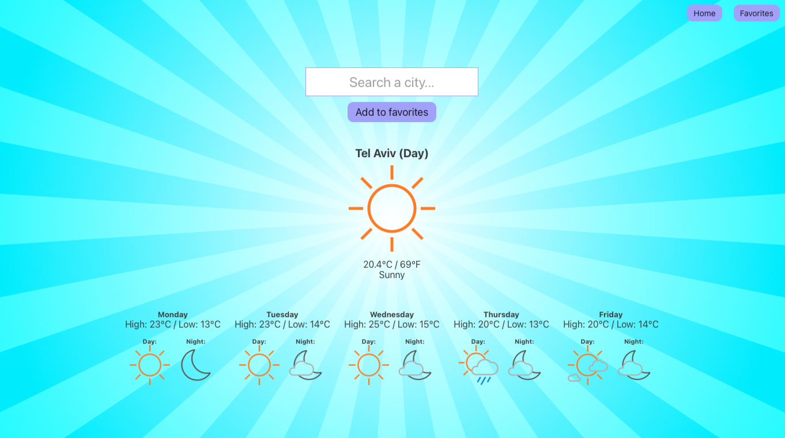

# AccuWeather - ReactJS

This project was bootstrapped with [Create React App](https://github.com/facebook/create-react-app).

## OVERVIEW

Write a simple, responsive, web app in React.js that shows the weather of some city. The user should
be able to search for a city and save it to favorites (locally, a server is not required).

We expect to see 2 pages in this app. (weather page and favorites page).

## API

The API that you’ll use for this app is [AccuWeather API](https://developer.accuweather.com). Please
signup and create a new app in order to get an API key.

You will use 3 endpoints:
[location autocomplete](https://developer.accuweather.com/accuweather-locations-api/apis/get/locations/v1/cities/autocomplete)
for the search field,
[get current weather](https://developer.accuweather.com/accuweather-current-conditions-api/apis) and
[5-day daily forecast](https://developer.accuweather.com/accuweather-forecast-api/apis). Please read
those API docs.

NOTE: this API is limited to 50 requests per day. our recommendation is to save the responses and
use them locally during development.

## Preview:

